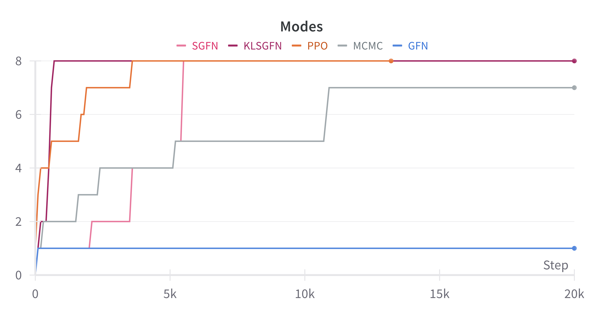
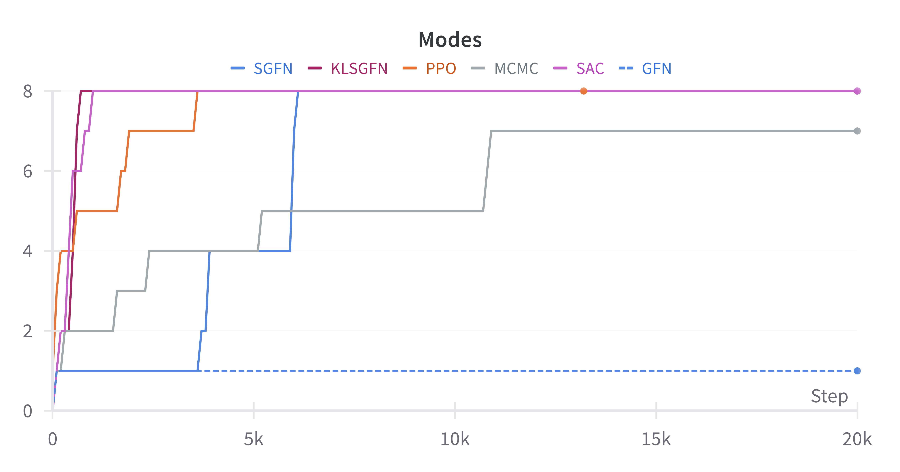
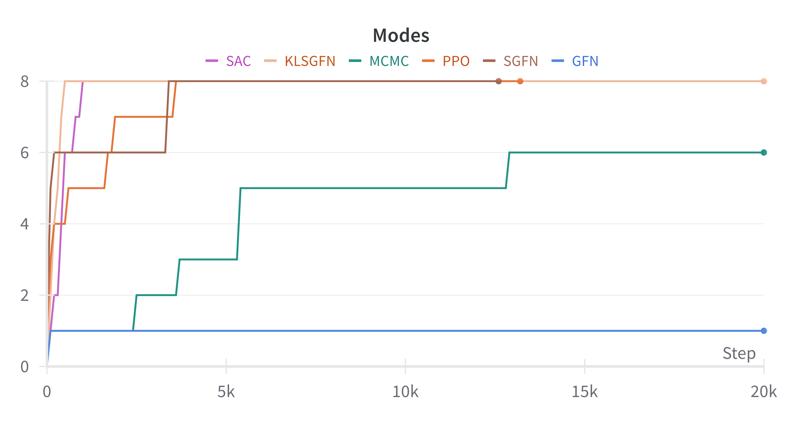
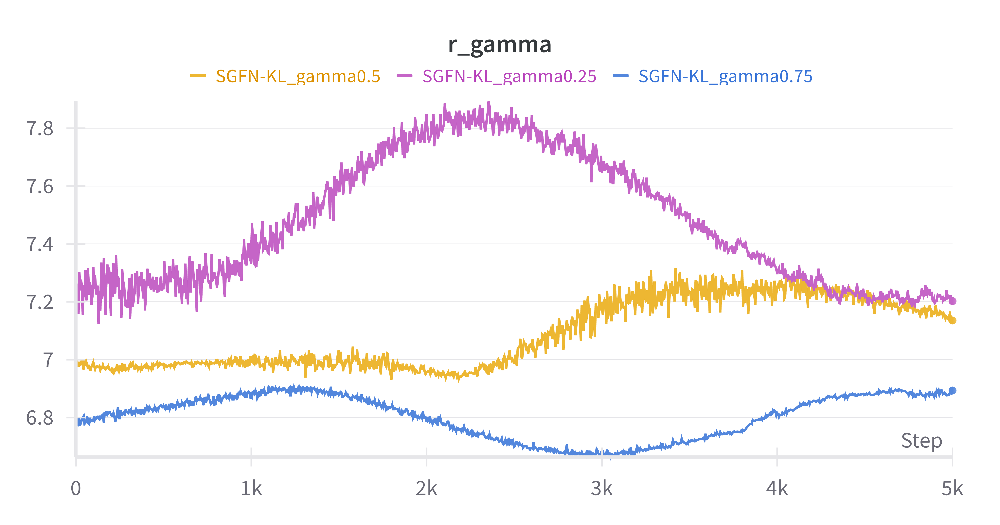
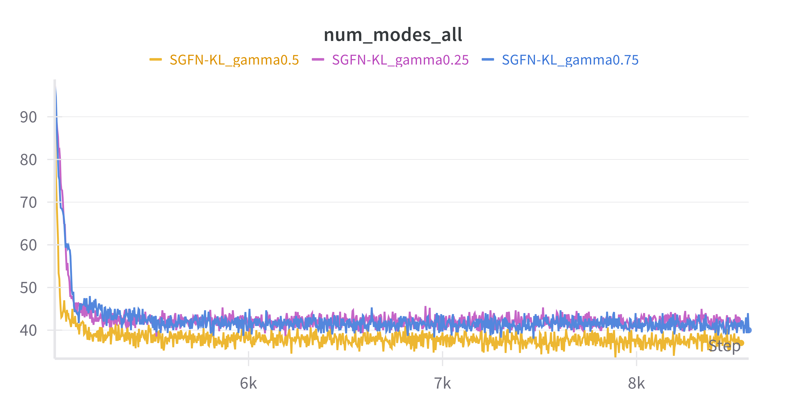
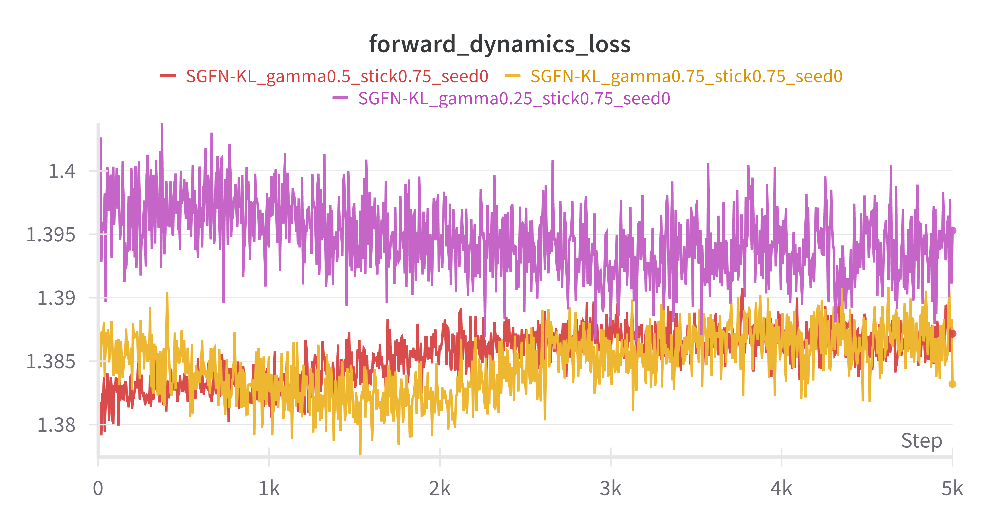

# Stochastic-Environments-for-Sequential-Decision-Making

This repo introduce Stochastic Generative Flow Networks, an innovative approach designed to model environments with inherent stochasticity in state transitions.

### Code references

Our implementation is heavily based on "Towards Understanding and Improving GFlowNet Training" (https://github.com/maxwshen/gflownet).

### Large Files

You can download additional large files by following link: https://drive.google.com/drive/folders/1JobUWGowoiQxGWVz3pipdfcjhtdY4CVq?usp=sharing

These files should be placed in `datasets`

### Installation

- Create conda environment:

```sh
conda create -n gfn-stochEnv python=3.10
conda activate gfn-stochEnv
```

## Environment Setup

To install dependecies, please run the command `pip install -r requirements.txt`.
Note that python version should be < 3.8 for running RNA-Binding tasks. You should install `pyg` with the following command

```
pip install torch_geometric
pip install pyg_lib torch_scatter torch_sparse torch_cluster torch_spline_conv -f https://data.pyg.org/whl/torch-1.13.0+cu117.html
```

## Optional Dependencies

- Install PyTorch with CUDA. For our experiments we used the following versions:

```sh
conda install pytorch==2.0.0 torchvision==0.15.0 pytorch-cuda=11.8 -c pytorch -c nvidia
```

or with pip see [most updated version](https://pytorch.org/get-started/locally/)

```sh
pip3 install torch torchvision torchaudio
```

You can change `pytorch-cuda=11.8` with `pytorch-cuda=XX.X` to match your version of `CUDA`.

- Install core dependencies:

```sh
pip install -r requirements.txt
```

-_(Optional)_ Install dependencies for molecule experiemnts

```sh
pip install -r requirements_mols.txt
```

### For MAC-OS USERS

Due to incompatibility of certain versions of `torch-sparse` and `torch-scatter`. You can run these commands

```sh
pip install git+https://github.com/rusty1s/pytorch_sparse.git
pip install torch-scatter -f https://data.pyg.org/whl/torch-2.1.0+${CUDA}.html
pip --no-cache-dir install torch-geometric

```

## Running the grid-search with all experiments

```sh
python grid/run_experiments.py
```

### Molecule Generation for Drug Discovery

#### TF8-Binding

The TF8Bind experiment using GFlowNets is designed to model the process of discovering DNA sequences that bind strongly to a transcription factor (TF). Here's an overview of how the experiment typically works:

### Objective

TF8Bind focuses on discovering optimal DNA sequences of length 8 (hence the "8") that maximize binding affinity to a given transcription factor. The goal is to model the process of exploring the vast sequence space of DNA (comprising 4 possible nucleotides for each position) and efficiently finding sequences with high binding affinity.

### Experiment Design

1. **Sequence Space Representation**:
   DNA sequences are represented as strings of length 8, where each position can take one of four nucleotides (A, C, G, T). This creates a search space of \(4^8 = 65536\) possible sequences.

2. **GFlowNet Framework**:
   GFlowNets are used to explore the sequence space in a directed manner, by learning a generative policy that favors high-binding-affinity sequences while ensuring good coverage of the space.

   - **States**: Partial or full sequences of DNA (e.g., starting from an empty sequence and growing it nucleotide by nucleotide).
   - **Actions**: Adding a nucleotide (A, C, G, or T) to the growing sequence.
   - **Reward**: The reward for generating a complete DNA sequence is proportional to the binding affinity of that sequence to the transcription factor, as predicted by a binding affinity model (e.g., TFBind model).

3. **Binding Affinity Prediction**:
   The experiment uses a pre-trained or known model to predict the binding affinity of any given 8-mer sequence. The reward for each sequence is derived from this prediction, and the GFlowNet is trained to generate sequences with higher rewards.

4. **Training Process**:
   - The GFlowNet is trained to generate sequences with high binding affinity using the reward model. During training, the GFlowNet explores the sequence space and receives feedback based on the predicted binding affinity.
   - **Detailed Balance (DB)** or **Trajectory Balance (TB)** loss functions are used to optimize the generative policy. These losses ensure that the flow through each state-action pair matches the target distribution of the sequences proportional to their binding affinity.
5. **Exploration vs. Exploitation**:
   GFlowNets balance exploration and exploitation by ensuring that sequences with high rewards are favored while still covering diverse parts of the sequence space. Unlike other methods like reinforcement learning, which may over-exploit certain regions, GFlowNets encourage broader exploration while still focusing on promising sequences.

### Evaluation

The performance of the GFlowNet is evaluated by:

- **Binding Affinity**: How well the generated sequences perform in terms of binding affinity to the transcription factor.
- **Diversity**: The diversity of high-affinity sequences found, to ensure that the method is not just finding a small number of similar sequences.
- **Efficiency**: The speed and efficiency at which the model discovers high-binding sequences compared to baselines like reinforcement learning or random search.

This experiment shows the effectiveness of GFlowNets in efficiently exploring large combinatorial spaces (like DNA sequences) and optimizing for specific objectives such as binding affinity, while also maintaining diversity in the discovered solutions.

### Running the TFBind8 experiment

The TFBIND8 Generated Data looks like this:

Result:

```
Sequence: ACCGACGC
Score: 0.7000
Reasoning:
- Found 2 CG motif(s): +1.40
- Found 1 GC motif(s): +0.60
- Found 1 adjacent repeat(s): +0.10

Sequence: GAGGCTCC
Score: 0.2667
Reasoning:
- Found 1 GC motif(s): +0.60
- Found 2 adjacent repeat(s): +0.20

Sequence: ATAATGAC
Score: 0.5000
Reasoning:
- Found 2 AT motif(s): +1.00
- Found 1 TA motif(s): +0.40
- Found 1 adjacent repeat(s): +0.10

Sequence: AGATTTGC
Score: 0.4333
Reasoning:
- Found 1 AT motif(s): +0.50
- Found 1 GC motif(s): +0.60
- Found 2 adjacent repeat(s): +0.20

Sequence: TAAAAACT
Score: 0.2667
Reasoning:
- Found 1 TA motif(s): +0.40
- Found 4 adjacent repeat(s): +0.40

Sequence: TTCGGATA
Score: 0.6000
Reasoning:
- Found 1 AT motif(s): +0.50
- Found 1 CG motif(s): +0.70
- Found 1 TA motif(s): +0.40
- Found 2 adjacent repeat(s): +0.20

Sequence: GATAAAGA
Score: 0.3667
Reasoning:
- Found 1 AT motif(s): +0.50
- Found 1 TA motif(s): +0.40
- Found 2 adjacent repeat(s): +0.20

Sequence: CAACATGC
Score: 0.4000
Reasoning:
- Found 1 AT motif(s): +0.50
- Found 1 GC motif(s): +0.60
- Found 1 adjacent repeat(s): +0.10

Sequence: CGGCGAGC
Score: 0.9000
Reasoning:
- Found 2 CG motif(s): +1.40
- Found 2 GC motif(s): +1.20
- Found 1 adjacent repeat(s): +0.10

Sequence: GTCTGGGG
Score: 0.1000
Reasoning:
- Found 3 adjacent repeat(s): +0.30
```

Run Experiments of TFBIND

```
python tfb/run_tfbind.py --gen_num_iterations 5000 --gen_episodes_per_step 16 --gen_reward_exp 3 --gen_reward_min 0 --gen_reward_norm 1 --gen_random_action_prob 0.001 --gen_sampling_temperature 2.0 --gen_leaf_coef 25 --gen_reward_exp_ramping 3 --gen_balanced_loss 1 --gen_output_coef 10 --gen_loss_eps 1e-5 --method db --num_tokens 4 --gen_num_hidden 64 --gen_num_layers 2 --gen_dropout 0.1 --gen_partition_init 150.0 --gen_do_explicit_Z --gen_L2 0.0 --dynamics_num_hid 128 --dynamics_num_layers 2 --dynamics_dropout 0.1 --dynamics_partition_init 150.0 --dynamics_do_explicit_Z --dynamics_L2 0.0 --dynamics_lr 1e-3 --dynamics_clip 10.0 --dynamics_off_pol 0.0 --gen_data_sample_per_step 16 --proxy_num_iterations 3000 --proxy_num_dropout_samples 25 --proxy_num_hid 128 --proxy_num_layers 2 --proxy_dropout 0.1 --proxy_learning_rate 1e-3 --proxy_num_per_minibatch 32 --stick 0.25
```

# Run experiments of TFBIND

## Available methods: SAC, PPO, SGFN-KL, SGFN-DB, GFN-DB

### Run experiments of TFBIND with SAC

```
python tfb/run_experiments.py --config tfb/config.yaml --method SAC --task tfbind
```

### Run experiments of TFBIND with SGFN-KL

```
python tfb/run_experiments.py --config tfb/config.yaml --method SGFN-KL --gamma 0.25 --stick 0.25
```

### Experiment Results of GRID-SEARCH




Comparison results of the number of modes captured during training for GRID-SEARCH experiment for different level of stochasticity

### Experiment Results of TFBIND with SGFN-KL




Comparison results of the Entropy Search, number of modes and dynamic loss captured during training for TFBIND experiment for different level of gamma with stochasticity level α = 0.25.
